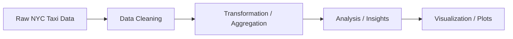

# AI Engineering: NYC Taxi Dataset
*Mainly using pySpark on Google Colab*


---

## Overview

This project is a **coursework assignment** for the AI Engineering module, analyzing the **NYC Taxi Dataset** with millions of records. The project demonstrates:

* Handling **large-scale datasets**
* Distributed data processing with **Apache Spark**
* Building **end-to-end data pipelines**
* Big data analysis using **Python** and **Google Colab**

---

## Tech Stack

* **Apache Spark** – Distributed data processing
* **Python** – Data manipulation and analysis
* **Google Colab** – Notebook environment for computation
* **Google Drive** – Storage for large datasets
* **Big Data Analytics** – Techniques for handling massive datasets
* **Pipeline Implementation** – Preprocessing, transformation, and analysis workflows

---

## Project Highlights

* Worked with **datasets containing millions of rows**
* Explored **Apache Spark** for distributed computation
* Implemented **data pipelines** for efficient analysis

**Visualization / Dashboard Placeholders**


---

## Key Takeaways

* Hands-on experience with **large-scale datasets**
* Understanding of **Spark operations and optimization**
* Learned techniques for **scalable data engineering and pipeline implementation**

---


**Pipeline for the NYC Taxi Dataset**:



---

## Suggested Folder Structure

```text
AI_Engineering_NYC-Taxi-Dataset/
│
├── notebooks/                 # Google Colab notebooks
│   └── NYC_Taxi_Analysis.ipynb
├── data/                      # Sample datasets
│   └── sample_taxi_data.csv
├── assets/
│   └── images/                # Screenshots / plots
│       ├── distribution_plot.png
│       └── pipeline_diagram.png
├── README.md                  # README
└── requirements.txt           # Dependencies
```

---

## Requirements (`requirements.txt`)

```txt
google colab
pyspark==3.5.0
pandas==2.1.0
numpy==1.26.0
matplotlib==3.8.0
seaborn==0.12.3
```

---

## How to Run

1. Clone the repository:

```bash
git clone https://github.com/your-username/AI_Engineering_NYC-Taxi-Dataset.git
```

2. Install dependencies:

```bash
pip install -r requirements.txt
```

3. Open the notebook in **Google Colab** and run the analysis step-by-step.

Reach out to rezatayeb2017@gmail.com for more info on this project.
